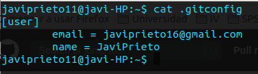
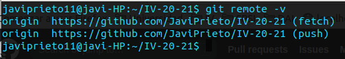

# Configuración del entorno de desarrollo

## Configuración de git

Para ver que hemos configurado correctamente git, aquí se muestra una captura de pantalla con el nombre y email correspondiente a los commits que se realizarán:

Además hemos ejecutado un git remote -v para ver que las dos ramas: fetch y push provienen de origin:

